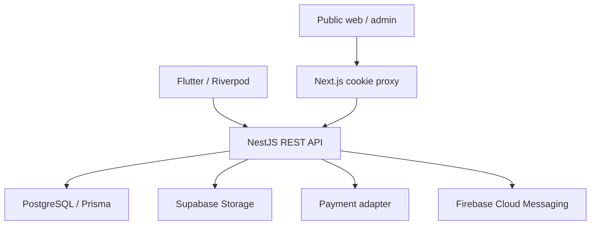

# KhabarFori architecture

## Runtime boundaries

The browser does not receive the production JWT in JavaScript. Next.js stores it in HttpOnly SameSite cookies and proxies requests to the API. Flutter stores tokens in platform secure storage and authenticates directly. PostgreSQL remains the production source of truth; no browser-local storage contains authoritative records.

The Sites review deployment uses the same React UI on Vinext/Cloudflare and owner-isolated D1 records for safe interactive evaluation. It is not a replacement production database and does not seed private company records. The preview can instead proxy a deployed NestJS API by setting its server-side `KHABARFORI_API_URL`.

## Repository

| Location | Responsibility |
|---|---|
| `app/` | Shared RTL workspace, article discussions, review API gateway |
| `components/ui/` | Accessible installed interface primitives |
| `lib/sample.ts` | Explicitly fictional review content |
| `production/proxy.ts` | Cookie isolation, refresh and API forwarding |
| `apps/admin/` | Generated standalone Next.js application |
| `backend/src/auth.ts`, `security.ts` | Authentication, token revocation and permission enforcement |
| `backend/src/news.ts` | News lifecycle, premium access, comments and reactions |
| `backend/src/platform.ts` | Organization, profiles, editorial workflow and analytics |
| `backend/src/integrations.ts` | Storage, payments and notification adapters |
| `backend/prisma/` | Relational schema, migrations and controlled seeds |
| `mobile/lib/features/news/` | Domain contract, repository adapter and Riverpod presentation |
| `mobile/lib/core/` | API transport and secure authentication session |

Other mobile features currently use the shared transport and screen module. Split them into separate feature packages as team ownership grows; only the news feature currently has a full explicit domain/repository boundary.

## Data model

All requested tables are included: users, roles, permissions, user_roles, news, categories, tags, comments, bookmarks, vip_plans, subscriptions, payments, employees, departments, editor_messages, notifications, analytics and settings.

Additional join/security tables: role_permissions, news_tags, refresh_tokens, password_resets, reactions and devices. UUIDs identify entities; composite unique keys prevent duplicate bookmarks, reactions, role grants and tag assignments. Payment idempotency keys, provider references, transaction IDs and payment-to-subscription links are unique. UTC intervals represent subscriptions. Integer **IRR** values are stored; the UI displays **toman** by dividing by ten.

Indexes support publication order, category/status filtering, author drafts, popular articles, subscription expiry, message inboxes and unread notifications. The initial SQL adds monetary and date constraints and enables RLS so anonymous Supabase Data API clients have no access policies. The backend database role must own the tables or have an explicitly designed policy; never give it to clients.

## Authorization

Roles grant named permissions through relational joins. Tokens carry identity and a version, not authoritative permissions. Each authenticated request reloads current permissions and checks `tokenVersion` and `active`. This favors correctness over aggressive caching. Before scaling, cache permission snapshots briefly with explicit invalidation on role/password changes.

`VIP_SUBSCRIBER` is a role label, not a paid entitlement. Content access requires a valid subscription time interval, or authorized editorial access. Lists contain only summaries, including for VIP articles. Non-public draft IDs return 404 to unauthorized users. Article text is rendered as text, not trusted HTML.

## Publishing and editorial workflow

Employees may create/edit their own unpublished drafts and submit them for review. Editors publish. Published content cannot be changed by an employee without editorial authority. Delete archives news. Messages are scoped to their author unless the caller can read the editorial inbox; only authorized editors reply and change workflow status.

## Subscription flow

1. Load an active plan and snapshot its amount/currency on a payment row.
2. Require an idempotency key and create or reuse a checkout.
3. Validate HMAC on the provider callback's raw body.
4. Independently verify payment status, reference, amount, currency and transaction ID with the provider.
5. Lock the user's row, finalize the payment and create a subscription in one transaction.
6. Extend from the latest subscription expiry; clamp month-end dates (including leap years).

No callback or client-side success screen grants access without server verification. A real provider adapter matching the documented contract must be installed before taking money.

## Growth toward millions of readers

Start with a modular monolith and a pooled Supabase/PostgreSQL connection. The free-tier database is an initial development choice, not a capacity promise.

A staged scale path:

1. Cache public summaries at an edge/CDN. Keep authenticated, internal and premium responses private/no-store. Serve immutable covers from object storage/CDN.
2. Run stateless API replicas behind a load balancer. Use Redis-backed global throttling and permission/session invalidation. The current NestJS in-memory limiter is per process.
3. Move notifications, analytics and media processing to durable queues with retry/dead-letter handling. Currently notification sending is an adapter service; no durable delivery worker is included.
4. Replace synchronous view writes and aggregate scans with an event stream and precomputed reporting tables. Partition analytics by time and enforce retention.
5. Add read replicas and independent search infrastructure only after query/load measurements justify them. The initial search is PostgreSQL case-insensitive substring search, not Persian linguistic search.
6. Test explicit SLOs, recovery procedures, connection pool budgets and peak workloads. No load test or million-user benchmark has been executed here.

Suggested launch SLO targets must be selected by the operating team. Keep payment consistency and draft/premium isolation ahead of caching optimizations.
